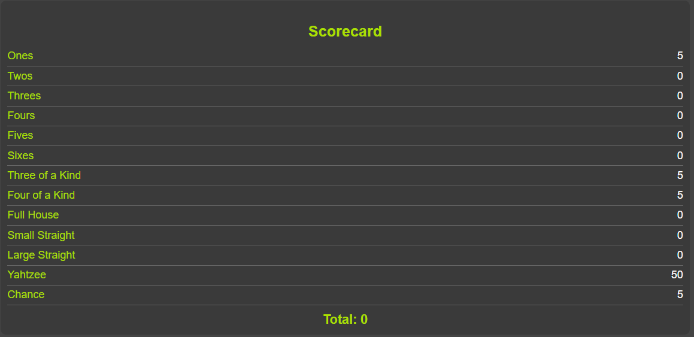
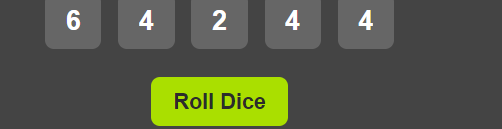

# Portfolio Overview

This portfolio showcases my projects, including a **Yahtzee Game** implementation and a professionally designed portfolio website. Each project highlights my skills in web development, user interface design, and responsive layouts.

## Table of Contents
- [Portfolio Overview](#portfolio-overview)
- [Yahtzee Game](#yahtzee-game)
  - [Features](#features)
  - [How to Play](#how-to-play)
  - [Installation](#installation)
  
---
 
- [Portfolio Design](#portfolio-design)
  - [Color Palette](#color-palette)
  - [Typography](#typography)
  - [Layout Components](#layout-components)
  - [Responsive Design](#responsive-design)
  - [Interactivity](#interactivity)

---

# Yahtzee Game 

This project is a web-based implementation of the classic **Yahtzee** game. The game is built using HTML, CSS, and JavaScript, and provides an interactive UI for rolling dice, holding them, and scoring points based on traditional Yahtzee rules.

### Features
- **Interactive Scorecard**: Displays various scoring categories like "Ones," "Twos," "Full House," and "Yahtzee."
- **Dice Roll and Hold**: Allows users to roll the dice up to three times per turn and hold dice between rolls.
- **Real-Time Scoring**: Scores are automatically calculated based on dice values and selected categories.
- **End Turn Functionality**: Players can end their turn to reset dice and start fresh.

### How to Play
1. Click "Roll Dice" to roll all five dice.
2. Click on any dice to "hold" it, preventing it from rolling in subsequent rolls.
3. Roll up to three times per turn, then select a score category to apply your current roll's score.
4. Continue until all score categories are filled to complete the game.

### Installation
1. Clone this repository:
   ```bash
   git clone https://github.com/your-username/yahtzee-game.git

# Portfolio Design

## Color Palette
The colors used throughout the site are designed to create a clean and modern aesthetic, ensuring clarity and readability.
- **Background**: `#2c2c2c` (dark grey for the main background) and `#444` for the game container.
- **Text Color**: White `#ffffff` for high contrast on the dark background.
- **Button Background**: `#aadf00` for interactive elements like buttons, with hover states changing to a darker green `#94c200`.

## Typography
The site uses a bold, sans-serif font to ensure readability and emphasize headers:
- **Primary Font**: `Arial, sans-serif`
- **Font Sizes**:
  - Title Font Size: `2.5em` for the game title.
  - Header Font Size: `1.4em` for section headers.
  - Body Text Size: `1.2em` for total score and other important labels.

## Layout Components

### 3.1 Header

- **Design**: The header displays the main title ("Yahtzee Game") centered at the top of the page, styled with a large, bold font in a vibrant green color.
- **Flexbox**: The container layout uses Flexbox for aligning components centrally within the page.

### 3.2 Main Section

- **Introduction**: This section contains the primary game elements, including the scorecard, dice section, and control buttons.
- **Flexbox Layout**: Each element in the main section is organized using Flexbox to ensure they stay centered and properly spaced within the container.

### 3.3 Scorecard Section

- **Scorecard Display**: Each scoring category (Ones, Twos, Full House, Yahtzee, etc.) is listed with labels and score fields, separated by borders for easy readability.
- **Styling**: The scorecard has a dark background color (`#3a3a3a`) with category labels in green to match the color scheme.

### 3.4 Dice Section

- **Dice Display**: Five dice are displayed side-by-side in the dice section. Each die is styled with a grey background and bold white numbers.
- **Interactivity**: Dice can be clicked to toggle a "held" state, changing their background to lime green with a border for visual feedback.

## Responsive Design
The website is designed to be fully responsive:
- **Flexbox Layout**: Using Flexbox for the main container and other sections ensures that elements are aligned and spaced consistently on different screen sizes.
- **Button and Font Scaling**: Font sizes and button dimensions adjust to maintain readability and usability on smaller devices.

## Interactivity
The website incorporates interactive elements:
- **Hover Effects**: Buttons feature hover effects that subtly change their background color, enhancing user engagement.
- **Click Events**: Dice elements respond to clicks by toggling a "held" state, visually changing color and background to indicate that they are held for the next roll.